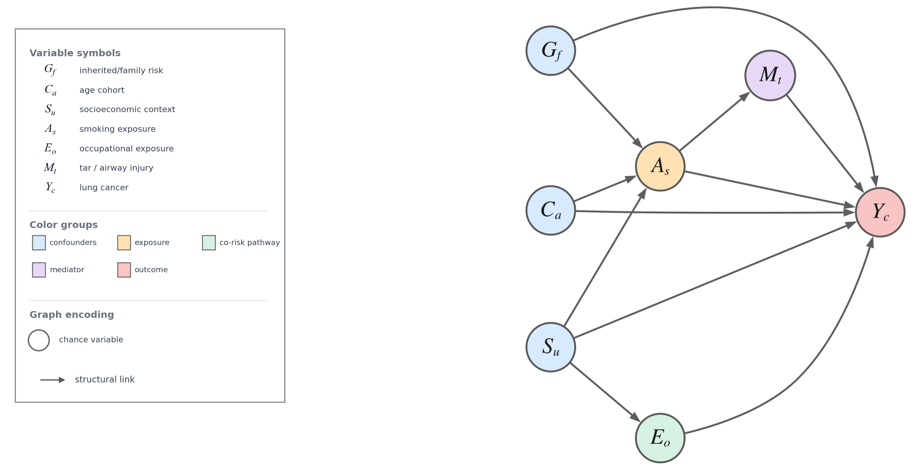
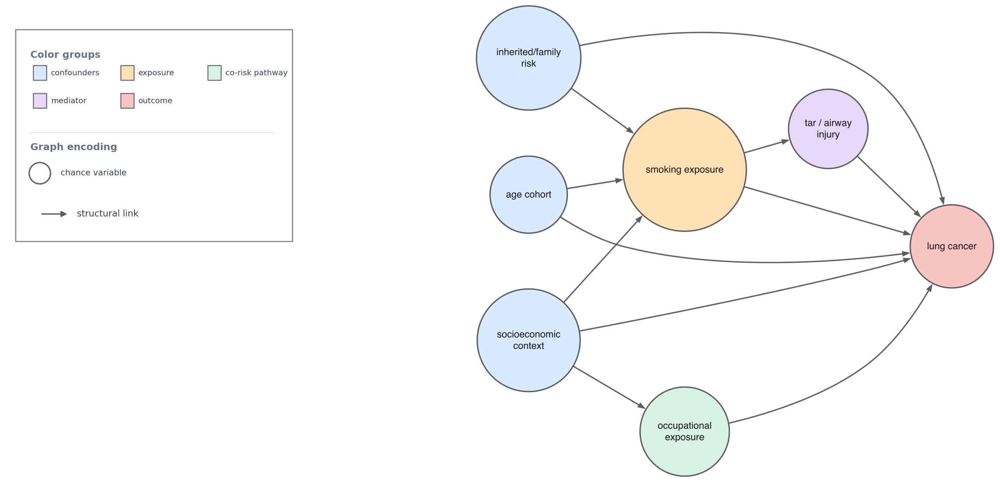

# SCM Figure Builder Skill

Codex skill for building publication-quality structural causal model (SCM), causal DAG, and graphical-model figures.

It supports two figure styles:

- **Mathematical SCM**: nodes contain mathematical symbols only; the legend maps symbols to variables.
- **Expanded node names**: nodes contain short semantic labels for readable report/audit figures.

## Example Output

Both figures below are rendered from the same multi-confounder smoking/lung-cancer SCM spec.
The graph uses Graphviz/DOT for layout and Matplotlib for the legend.
The mathematical panel demonstrates subscripted variable symbols such as `S_u`, `A_s`, and `Y_c`.

### Mathematical SCM



### Expanded Node Names



The rendering approach is the one used for the MDAI thesis SCM figures:

1. Define the SCM as JSON.
2. Use Graphviz/DOT for automatic node placement and edge routing.
3. Use Matplotlib for the publication legend and mathtext symbol table.
4. Export DOT, SVG, graph-only PNG, final PNG, final PDF, and caption sidecars.

## Install In Codex

Clone this repository, then copy the skill folder into your local Codex skills directory:

```bash
mkdir -p ~/.codex/skills
cp -R skills/scm-figure-builder ~/.codex/skills/scm-figure-builder
```

Restart Codex if the skill picker does not refresh automatically.

For a repository-scoped install, copy the skill into a repo:

```bash
mkdir -p .agents/skills
cp -R skills/scm-figure-builder .agents/skills/scm-figure-builder
```

## Use The Renderer Directly

```bash
python3 skills/scm-figure-builder/scripts/render_scm_figure.py \
  --spec examples/smoking_lung_cancer_confounding_spec.json \
  --out /tmp/scm_math.png \
  --mode math
```

Use `--mode expanded` for semantic node labels:

```bash
python3 skills/scm-figure-builder/scripts/render_scm_figure.py \
  --spec examples/smoking_lung_cancer_confounding_spec.json \
  --out /tmp/scm_expanded.png \
  --mode expanded
```

If system Graphviz `dot` is unavailable, pass a Viz.js renderer compatible with `tools/graphviz-renderer/render-dot.mjs`:

```bash
python3 skills/scm-figure-builder/scripts/render_scm_figure.py \
  --spec examples/smoking_lung_cancer_confounding_spec.json \
  --out /tmp/scm_math.png \
  --mode math \
  --vizjs-renderer /path/to/render-dot.mjs
```

## Requirements

- Python 3
- Matplotlib
- One Graphviz rendering backend:
  - system `dot`, or
  - a compatible Viz.js renderer passed with `--vizjs-renderer`

## Included Files

- `skills/scm-figure-builder/SKILL.md`: Codex skill instructions.
- `skills/scm-figure-builder/scripts/render_scm_figure.py`: reusable renderer.
- `skills/scm-figure-builder/references/scm_figure_contract.md`: figure semantics and quality contract.
- `skills/scm-figure-builder/references/example_scm_spec.json`: minimal example graph specification.
- `examples/smoking_lung_cancer_confounding_spec.json`: richer colored course-style confounding example.
- `examples/smoking_lung_cancer_confounding_math.png`: rendered mathematical SCM screenshot.
- `examples/smoking_lung_cancer_confounding_expanded.png`: rendered expanded-node screenshot.
